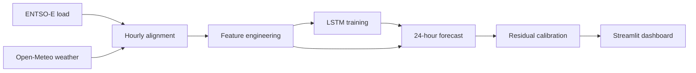

# Switzerland Electricity Load Forecasting

An end-to-end forecasting project for Swiss electricity demand. It combines ENTSO-E load observations with Open-Meteo weather data, trains a 24-hour LSTM forecaster, calibrates uncertainty from recent residuals, and serves the result through an operational Streamlit dashboard.

## Dashboard

The dashboard is designed around the questions a forecast user needs to answer:

- What is the expected load over the next 24 hours?
- When will demand peak, and how large is the uncertainty?
- Does the model beat a naive baseline on recent data?

It provides:

- observed load, recent model backcasts, and the current forward forecast in one chart;
- calibrated prediction intervals with selectable confidence and calibration mode;
- model MAE/RMSE compared with a last-value naive baseline;
- interval coverage and calibration diagnostics

Launch it from the repository root:

```bash
poetry run streamlit run app/streamlit_app.py
```

The default paths are:

- model: `data/processed/models/best_lstm_24h.pt`
- features: `data/processed/lstm_features.parquet`

Both can be changed from **Data sources** in the sidebar.

## How it works



1. **Ingestion** stores incremental, partitioned load and weather observations.
2. **Processing** aligns the sources by UTC timestamp and engineers lagged, rolling, and cyclical predictors.
3. **Training** uses chronological train/validation/test splits, feature selection, early stopping, and a multi-output LSTM.
4. **Inference** forecasts all 24 lead times in one pass and estimates prediction bands from recent absolute residuals.
5. **Evaluation** compares the LSTM with a persistence baseline and reports empirical interval coverage.

The dashboard uses split-conformal-style residual quantiles. With per-horizon calibration enabled, each lead time receives its own interval width; pooled calibration uses one width across the full horizon.

## Quick start

### Requirements

- Python 3.12
- [Poetry](https://python-poetry.org/)
- an ENTSO-E API key only when fetching new load data

### Install

```bash
poetry install
```

Use the Poetry environment for every command. The Parquet artifacts are written with the versions pinned in `poetry.lock`; a different global PyArrow version may not be able to read them.

### Run with the existing artifacts

The repository includes the feature table and selected model artifact needed by the dashboard:

```bash
poetry run streamlit run app/streamlit_app.py
```

Open the local URL printed by Streamlit, usually `http://localhost:8501`.

## Rebuild the full pipeline

### 1. Configure ENTSO-E

Create a `.env` file at the repository root:

```env
ENTSOE_API_KEY=your_api_key_here
```

The file is ignored by Git. The weather ingestion does not require an API key.

### 2. Fetch source data

```bash
poetry run python src/ingestion/entsoe.py
poetry run python src/ingestion/openmeteo.py
```

The module entry points define their ingestion date ranges near the bottom of each file. Update those dates when extending the dataset. JSON files under `data/state/` track the latest completed timestamp so repeated runs remain incremental.

### 3. Build the aligned dataset and model features

```bash
poetry run python src/processing/processing.py
```

This creates:

- `data/interim/aggregated.parquet`
- `data/processed/lstm_features.parquet`

### 4. Train and evaluate the LSTM

```bash
poetry run python -m src.modeling.train_lstm
```

Training writes:

- `data/processed/models/best_lstm_24h.pt`
- `data/processed/models/best_lstm_24h.metrics.json`

The checkpoint contains the model weights, selected feature names, normalization statistics, lookback length, target name, and forecast horizon required for inference.

### 5. Start the dashboard

```bash
poetry run streamlit run app/streamlit_app.py
```

## Dashboard guide

### Forecast

The main chart combines recent observations, historical forecast estimates, the new forecast, and—when enabled—the prediction interval. Use **Hours to display** to shorten the forward view and **History to display** to change its context. Forecast values can be downloaded as CSV.

### Performance

Recent rolling windows are evaluated against a persistence baseline that repeats the final observed load across the forecast horizon.

| Metric | Interpretation |
| --- | --- |
| MAE | Mean absolute forecast error in MW; lower is better. |
| RMSE | Error metric that penalizes large misses more strongly. |
| MAE improvement | Percentage reduction in MAE relative to persistence. |
| Interval coverage | Share of observations contained by the prediction interval. |
| Mean interval width | Typical uncertainty-band width in MW; narrower is sharper. |

Coverage should be read together with width: very wide intervals can achieve high coverage without being operationally useful.

### Data & model

This view reports dataset coverage, missing model inputs, the target column, model lookback, feature count, inference device, and resolved artifact paths. It also exposes the latest feature rows for quick inspection.

## Repository layout

```text
.
├── .streamlit/
│   └── config.toml                 # Dashboard theme
├── app/
│   ├── dashboard_core.py           # Framework-independent analysis layer
│   └── streamlit_app.py            # Streamlit presentation layer
├── data/
│   ├── raw/                         # Partitioned source data
│   ├── interim/                     # Aligned hourly dataset
│   ├── processed/                   # Model-ready features and artifacts
│   └── state/                       # Incremental-ingestion checkpoints
├── notebook/                        # Exploratory analysis and experiments
├── src/
│   ├── ingestion/                   # ENTSO-E and Open-Meteo clients
│   ├── processing/                  # Alignment and feature engineering
│   ├── modeling/                    # Training, inference, and backtesting
│   └── validation/                  # Data validation utilities
├── poetry.lock
├── pyproject.toml
└── requirements.txt                 # Streamlit deployment dependencies
```

## Configuration

Default training settings live in `LSTMTrainConfig` in [`src/modeling/lstm_pipeline.py`](src/modeling/lstm_pipeline.py). The current defaults include:

- 336-hour lookback;
- 24-hour forecast horizon;
- chronological 70%/15%/15% train/validation/test split;
- early stopping with a five-epoch patience;
- a five-layer LSTM with 128 hidden units.

Operational dashboard constants—such as the number of calibration and evaluation windows—are at the top of [`app/streamlit_app.py`](app/streamlit_app.py).

## Troubleshooting

**`Repetition level histogram size mismatch` while reading Parquet**

Run the app through Poetry. This usually indicates that a global PyArrow version differs from the version used to write the checked-in feature file.

**Model or feature table not found**

Build the missing stage with the commands above, or select another artifact from **Data sources** in the sidebar.

**Prediction intervals are unavailable**

The dashboard falls back to a point forecast when calibration cannot run. Confirm that the feature table contains the target column and enough observed history for the calibration windows.

**The first run is slow**

Loading the PyTorch checkpoint and calculating recent backtests is the expensive path. Results are cached for subsequent reruns and automatically invalidated when an artifact's modification time changes.


Useful next steps are configurable ingestion commands, scheduled refresh/retraining, experiment tracking, and production monitoring for error, coverage, drift, and data freshness.

## License

Licensed under the [Apache License 2.0](LICENSE).
